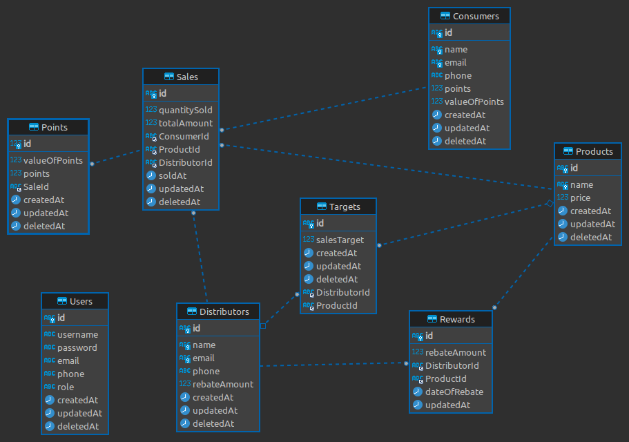

# Mzawadi Loyalty Assignment

## Back End For the Mzawadi Loyalty Assignment

## Prerequisites

- [Node.js](https://nodejs.org/en/download/) (>= 16.15.0)
- [NPM](https://www.npmjs.com/get-npm)
- [Git](https://git-scm.com/downloads)
- [VS Code](https://code.visualstudio.com/download) (Recommended)
- [MySQL](https://www.mysql.com/downloads/) (>= 8.0.26)
- [Postman](https://www.postman.com/downloads/) (Recommended)
- [mzawadi-assignment-front-end](https://github.com/phanuell-365/mzawadi-assignment-front-end) - Front End

## Description

This is the back end for the Mzawadi Loyalty Assignment. It is a REST API that is used to
manage ` company (x), dealing with distributors is seeking to gather end consumer data through its distributors sales channel. To achieve this it is rewarding the distributors 3% rebate on achievement of its target for sale of product y, capped to the sales target. For each sale made by the distributor 1% of the sale transaction is to be extended to the end consumer as points valued at ksh 0.5 per point. You are to come up with a system to help company x manage this.`.
It is built using Node.js, Express.js with Nest.js,and MySQL.

## Project Setup

Please ensure that you have the prerequisites installed before proceeding with the installation.

### Environment Variables

The following environment variables are required for the application to run:

- `PORT` - The port number on which the application will run. Default is `3000`.
- `TEST_PORT` - The port number on which the application will run during testing. Default is `3001`.
- `DB_HOST` - The host name of the database. Default is `localhost`.
- `DB_PORT` - The port number of the database. Default is `3306`.
- `DB_USER` - The username of the database. Default is `root`.
- `DB_PASSWORD` - The password of the database. Default is `password`.
- `DB_DIALECT` - The dialect of the database. Default is `mysql`.
- `DB_NAME_DEV` - The name of the development database. Default is `mzawadi_dev`.
- `DB_NAME_TEST` - The name of the test database. Default is `mzawadi_test`.
- `DB_NAME_PROD` - The name of the production database. Default is `mzawadi_prod`.
- `NODE_ENV` - The environment in which the application will run. Default is `development`.
- `PRV_KEY` - The private key used to sign the JWT token. They can be generated using the steps explained after this
  section.
- `PUB_KEY` - The public key used to verify the JWT token. They can be generated using the steps explained after this
  section.

### Generating the Private and Public Keys

The private and public keys are used to sign and verify the JWT token. The project comes with a script that can be used
to
generate the keys. The script is located in the `src/auth/keys` directory. To generate the keys, run the following
command:

```bash
npm run generate-keys
```

The keys will be generated and outputted to the console. Copy the keys and paste them in the `.env` file.
The keys should be enclosed in double quotes.

### Creating the Environment File

Create a `.env` file in the root directory of the project.
The project root directory is the directory that contains the `package.json` file.
The `.env` file should contain the environment variables as explained in the previous section.
Copy the contents of the `.env.example` file and paste them.
Then, update the values of the environment variables with the appropriate values in the `.env` file.
The `.env.example` file is located in the root directory of the project.

### Database Setup

- Create a database with the name `mzawadi_dev` for development.
- Create a database with the name `mzawadi_test` for testing.
- Create a database with the name `mzawadi_prod` for production.
- The migrations will be run automatically when the application starts.
- There are no seeders for this project.

### Clone the repository

```bash
git clone https://github.com/phanuell-365/mzawadi-assignment-back-end.git
```

- Enter the project directory

```bash
cd mzawadi-assignment-back-end
```

- Install the dependencies

```bash
npm install
```

- To run the application in development mode

```bash
npm run start
```

- To build the application for production

```bash
npm run start:prod
```

## Testing

- To run the tests

```bash
npm run test:e2e
```

# Business Rules

- A distributor can distribute any product to any consumer.
- A distributor has sales targets for each product.
- A distributor can distribute a product if the distributor has a sales target for the product.
- A distributor receives a 3% rebate on achievement of the sales target for a product.
- Sales targets are reset at the beginning of each day.
- 1 % of the total sales of a product is extended as points to the consumer valued at 0.5 ksh per point.

# Database Schema



# Short Description

This is a REST API that is used to manage
a `company (x), dealing with distributors is seeking to gather end consumer data through its distributors sales channel. To achieve this it is rewarding the distributors 3% rebate on achievement of its target for sale of product y, capped to the sales target. For each sale made by the distributor 1% of the sale transaction is to be extended to the end consumer as points valued at ksh 0.5 per point. You are to come up with a system to help company x manage this.`
It is built using Node.js, Express.js with Nest.js, and MySQL.

## Features

### Consumers

- Create a consumer
- Get a consumer
- Get all consumers
- Update a consumer
- Delete a consumer (Soft Delete, i.e. the consumer is not deleted from the database, but the `deletedAt` column is
  updated with the current timestamp) - Front end for the Mzawadi Loyalty Assignment will be implemented using Vue.js in
  the next release.

### Distributors

- Create a distributor
- Get a distributor
- Get all distributors
- Update a distributor
- Delete a distributor (Soft Delete, i.e. the distributor is not deleted from the database, but the `deletedAt` column
  is updated with the current timestamp) - Front end for the Mzawadi Loyalty Assignment will be implemented using Vue.js
  in the next release.
- Get the total points earned by a distributor

### Products

- Create a product
- Get a product
- Get all products
- Update a product
- Delete a product (Soft Delete, i.e. the product is not deleted from the database, but the `deletedAt` column is
  updated with the current timestamp) - Front end for the Mzawadi Loyalty Assignment will be implemented using Vue.js in
  the next release.

### Targets

- Create a target
- Get a target
- Get all targets
- Update a target
- Delete a target (Soft Delete, i.e. the target is not deleted from the database, but the `deletedAt` column is
  updated with the current timestamp) - Front end for the Mzawadi Loyalty Assignment will be implemented using Vue.js in
  the next release.

### Rewards

- Create a reward
- Get a reward
- Get all rewards
- Update a reward
- Delete a reward (Soft Delete, i.e. the reward is not deleted from the database, but the `deletedAt` column is updated
  with the current timestamp) - Front end for the Mzawadi Loyalty Assignment will be implemented using Vue.js in the
  next release.

### Points

- Create points
- Get points
- Get all points
- Update points
- Delete points (Soft Delete, i.e. the points are not deleted from the database, but the `deletedAt` column is updated
  with the current timestamp) - Front end for the Mzawadi Loyalty Assignment will be implemented using Vue.js in the
  next release.
- Get the total points earned by a consumer

### Authentication/Authorization & User Management

- Register a user (a default user is created when the application starts)
- Login a user
- Logout a user
- Refresh the JWT token
- Get the authenticated user
- Change the password of the authenticated user
- Reset the password of a user
- Verify the username of a user

## Launching the application

- To launch the application, depending on the mode you are running it in, you can use the following links:
- Development Mode: http://localhost:5173
- Production Mode: http://localhost:4173

## API Documentation

- The API documentation will be implemented in the next release.
- The API documentation will be available at `http://localhost:4173/api-docs` when running in production mode, and
  `http://localhost:5173/api-docs` when running in development mode.

## License

[MIT](https://choosealicense.com/licenses/mit/)

## Author

- [phanuell-365](https://github.com/phanuell-365)
